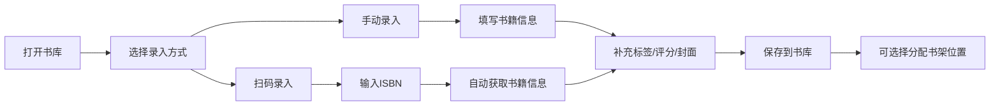
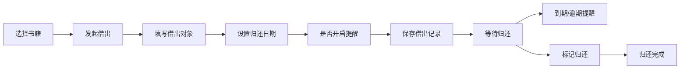
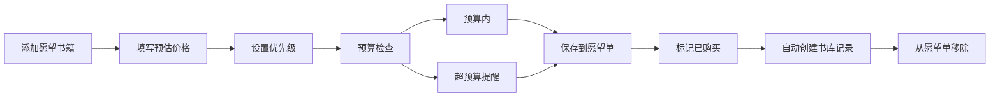

## 1. 产品概述

个人藏书管理桌面应用，面向爱买书、借书和整理书架的普通读者，帮助用户系统化管理个人图书资产，追踪阅读进度，记录借阅往来，规划购书清单。

- 核心目标：解决个人藏书管理混乱、借阅遗忘、购书重复、阅读计划缺失等痛点
- 目标用户：热爱阅读、频繁购书、乐于分享书籍的普通读者

## 2. 核心功能

### 2.1 用户角色
| 角色 | 注册方式 | 核心权限 |
|------|----------|----------|
| 普通用户 | 本地应用，无需注册 | 完整使用所有功能，数据本地存储 |

### 2.2 功能模块
1. **书库窗口**：扫码/手动录入、书籍列表、标签管理、评分、笔记、封面管理
2. **借阅窗口**：借出记录、归还管理、到期提醒、借阅历史
3. **书架窗口**：房间/柜层/编号三级定位、书架可视化、书籍位置分配
4. **愿望单窗口**：想买书籍、预算设置、优先级排序、购买追踪
5. **统计窗口**：阅读进度、年度购书统计、未读数量、重复书提醒、数据导入导出

### 2.3 页面详情
| 页面名称 | 模块名称 | 功能描述 |
|---------|----------|----------|
| 书库 | 录入模块 | 支持 ISBN 扫码录入（摄像头/手动输入）、手动录入书名、作者、出版社、购买价格、阅读状态 |
| 书库 | 书籍列表 | 多维度筛选（标签、作者、出版社、阅读状态）、搜索、排序 |
| 书库 | 书籍详情 | 标签管理、1-5星评分、阅读笔记、封面图片上传/编辑 |
| 借阅 | 借出登记 | 记录借出对象、借出日期、预计归还日期、设置提醒 |
| 借阅 | 归还管理 | 标记归还、查看逾期、催还提醒 |
| 借阅 | 借阅历史 | 所有借阅记录查询、统计借阅频率 |
| 书架 | 位置管理 | 维护房间、柜层信息，三级位置编码 |
| 书架 | 书籍定位 | 为每本书分配位置，按位置浏览书籍，位置搜索 |
| 书架 | 书架视图 | 可视化书架展示，拖拽调整书籍位置 |
| 愿望单 | 清单管理 | 添加想买书籍、设置预估价格、优先级（高/中/低） |
| 愿望单 | 预算控制 | 设置月度/年度预算，显示预算使用情况 |
| 愿望单 | 购买追踪 | 标记已购买，自动转入书库 |
| 统计 | 阅读进度 | 已读/在读/未读数量统计、阅读进度图表 |
| 统计 | 购书分析 | 年度购书金额、数量统计、按分类/作者/出版社统计 |
| 统计 | 重复提醒 | 自动检测重复书籍（同书名+同作者） |
| 统计 | 数据管理 | 支持 JSON/CSV 格式导入导出、数据备份恢复 |

## 3. 核心流程

### 3.1 书籍录入流程

### 3.2 书籍借阅流程

### 3.3 愿望单购买流程

## 4. 用户界面设计

### 4.1 设计风格
- **设计主题**：书香雅致 · 简洁现代
- **主色调**：暖棕色 (#8B6914) - 代表书籍、知识、温暖
- **辅助色**：米色 (#F5F0E1) - 代表纸张、阅读氛围
- **强调色**：墨绿色 (#2D5A27) - 代表书签、重点标记
- **中性色**：深灰 (#333333)、中灰 (#666666)、浅灰 (#EEEEEE)
- **按钮风格**：圆角 6px，轻微阴影，悬停时有微妙的上浮效果
- **字体**：标题使用 "Noto Serif SC"（衬线字体，书香气息），正文使用 "Noto Sans SC"（无衬线，易读性好）
- **布局风格**：左侧导航栏 + 右侧内容区，卡片式布局
- **图标风格**：Lucide 线性图标，统一 20px 尺寸

### 4.2 页面设计概述
| 页面名称 | 模块名称 | UI 元素 |
|---------|----------|---------|
| 书库 | 顶部工具栏 | 搜索框、筛选按钮、录入按钮（扫码/手动）、视图切换（列表/网格） |
| 书库 | 书籍列表 | 卡片式展示，封面图 + 书名 + 作者 + 标签 + 评分 + 阅读状态徽章 |
| 书库 | 详情面板 | 右侧抽屉式详情，封面大图、完整信息、标签编辑、评分组件、笔记编辑区 |
| 借阅 | 顶部统计 | 借出中数量、逾期数量、即将到期数量卡片 |
| 借阅 | 借出列表 | 借出对象、书籍信息、借出日期、归还日期、状态标签（正常/即将到期/逾期）、操作按钮 |
| 书架 | 位置导航 | 房间列表 → 柜层列表 → 书架格子，面包屑导航 |
| 书架 | 可视化视图 | 书架格子网格布局，每格显示书籍缩略图，支持拖拽 |
| 愿望单 | 预算面板 | 预算进度条、已花费、剩余预算、优先级筛选 |
| 愿望单 | 书籍列表 | 按优先级排序，显示书名、预估价格、优先级标签、购买按钮 |
| 统计 | 数据概览 | 总藏书量、已读数量、未读数量、本年购书金额四大卡片 |
| 统计 | 图表区 | 阅读进度环形图、月度购书柱状图、分类饼图 |
| 统计 | 数据管理 | 导入按钮、导出按钮、备份按钮、重复书检测结果列表 |

### 4.3 响应式
- 桌面端优先设计，窗口最小支持 1280x800 分辨率
- 内容区域支持自适应缩放，表格和列表支持横向滚动
- 侧边导航栏宽度固定 220px，内容区占剩余空间

### 4.4 交互细节
- 页面切换使用平滑过渡动画（300ms ease）
- 卡片悬停时轻微上浮并增加阴影
- 按钮点击有按压反馈效果
- 表单输入有焦点状态高亮
- 重要操作（删除、清空数据）有二次确认弹窗
- 提醒事项使用系统通知 + 应用内红点标记
