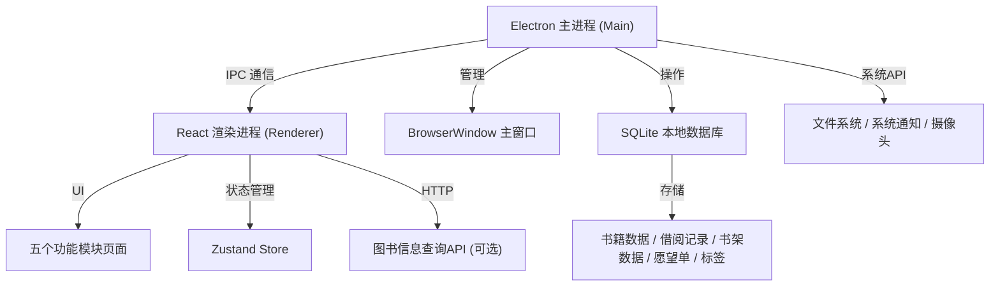
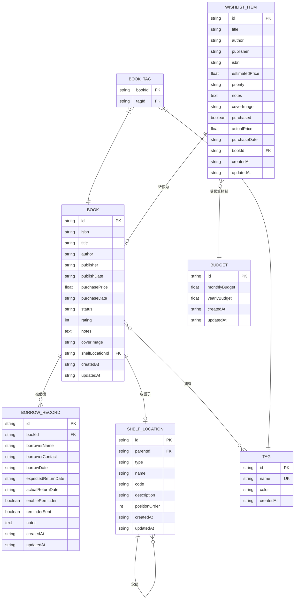

## 1. 架构设计



## 2. 技术描述

### 2.1 技术栈选型
- **前端框架**：React 18 + TypeScript
- **构建工具**：Vite 5
- **桌面框架**：Electron 28 + electron-builder
- **样式方案**：TailwindCSS 3
- **状态管理**：Zustand
- **路由管理**：React Router DOM 6
- **数据库**：better-sqlite3（本地 SQLite）
- **图表库**：recharts
- **图标库**：lucide-react
- **IPC 通信**：electron.ipcMain / electron.ipcRenderer

### 2.2 项目结构
```
├── electron/                  # Electron 主进程代码
│   ├── main.ts               # 主进程入口
│   ├── preload.ts            # 预加载脚本，暴露安全API
│   ├── database/             # 数据库相关
│   │   ├── index.ts          # 数据库初始化
│   │   ├── migrations.ts     # 数据库迁移
│   │   └── seed.ts           # 初始数据
│   └── ipc/                  # IPC 通信处理器
│       ├── books.ts          # 书籍相关IPC
│       ├── borrow.ts         # 借阅相关IPC
│       ├── shelf.ts          # 书架相关IPC
│       ├── wishlist.ts       # 愿望单相关IPC
│       └── stats.ts          # 统计相关IPC
├── src/                       # React 渲染进程代码
│   ├── components/           # 公共组件
│   │   ├── Layout/           # 布局组件
│   │   ├── BookCard/         # 书籍卡片
│   │   ├── Modal/            # 弹窗组件
│   │   ├── Rating/           # 评分组件
│   │   ├── TagInput/         # 标签输入组件
│   │   └── Toast/            # 消息提示
│   ├── pages/                # 页面组件
│   │   ├── Library/          # 书库页面
│   │   ├── Borrow/           # 借阅页面
│   │   ├── Shelf/            # 书架页面
│   │   ├── Wishlist/         # 愿望单页面
│   │   └── Stats/            # 统计页面
│   ├── store/                # Zustand 状态管理
│   │   ├── useBookStore.ts
│   │   ├── useBorrowStore.ts
│   │   ├── useShelfStore.ts
│   │   ├── useWishlistStore.ts
│   │   └── useStatsStore.ts
│   ├── hooks/                # 自定义 Hooks
│   │   ├── useIPC.ts         # IPC 调用封装
│   │   └── useToast.ts       # 消息提示
│   ├── types/                # TypeScript 类型定义
│   │   ├── index.ts
│   │   └── ipc.ts
│   ├── utils/                # 工具函数
│   │   ├── date.ts
│   │   ├── file.ts
│   │   └── validator.ts
│   ├── App.tsx               # 应用入口组件
│   ├── main.tsx              # 渲染进程入口
│   └── index.css             # 全局样式
├── shared/                    # 前后端共享类型
│   └── types.ts
├── public/                    # 静态资源
│   └── default-cover.jpg     # 默认书籍封面
├── package.json
├── tsconfig.json
├── vite.config.ts
├── tailwind.config.js
├── electron-builder.json
└── README.md
```

## 3. 路由定义

| 路由路径 | 页面名称 | 描述 |
|---------|----------|------|
| `/` | 书库 | 默认首页，展示所有书籍列表 |
| `/library` | 书库 | 同首页，书籍管理主页面 |
| `/borrow` | 借阅 | 借阅记录管理页面 |
| `/shelf` | 书架 | 书架位置管理页面 |
| `/wishlist` | 愿望单 | 购书愿望单页面 |
| `/stats` | 统计 | 数据统计和导入导出页面 |

## 4. IPC 通信定义

### 4.1 书籍管理 IPC
```typescript
// 获取书籍列表
interface GetBooksRequest {
  page?: number;
  pageSize?: number;
  search?: string;
  tag?: string;
  status?: 'unread' | 'reading' | 'read';
  sortBy?: 'title' | 'author' | 'purchaseDate' | 'rating';
  sortOrder?: 'asc' | 'desc';
}
interface GetBooksResponse {
  books: Book[];
  total: number;
}

// 新增/更新书籍
interface SaveBookRequest {
  id?: string;
  isbn?: string;
  title: string;
  author: string;
  publisher?: string;
  publishDate?: string;
  purchasePrice?: number;
  purchaseDate?: string;
  status: 'unread' | 'reading' | 'read';
  rating?: number;
  notes?: string;
  coverImage?: string;
  tags: string[];
  shelfLocationId?: string;
}

// 删除书籍
interface DeleteBookRequest {
  id: string;
}
```

### 4.2 借阅管理 IPC
```typescript
// 获取借阅记录
interface GetBorrowRecordsRequest {
  status?: 'active' | 'returned' | 'overdue';
}
interface GetBorrowRecordsResponse {
  records: BorrowRecord[];
}

// 创建借阅记录
interface CreateBorrowRequest {
  bookId: string;
  borrowerName: string;
  borrowerContact?: string;
  borrowDate: string;
  expectedReturnDate: string;
  enableReminder: boolean;
  notes?: string;
}

// 标记归还
interface ReturnBookRequest {
  recordId: string;
  actualReturnDate: string;
}
```

### 4.3 书架管理 IPC
```typescript
// 获取位置树
interface GetShelfLocationsResponse {
  rooms: Room[];
}

// 新增位置
interface SaveLocationRequest {
  id?: string;
  parentId?: string;
  type: 'room' | 'cabinet' | 'shelf' | 'slot';
  name: string;
  code?: string;
  description?: string;
}

// 分配书籍位置
interface AssignBookLocationRequest {
  bookId: string;
  locationId: string;
}
```

### 4.4 愿望单 IPC
```typescript
// 获取愿望单
interface GetWishlistResponse {
  items: WishItem[];
  budget: Budget;
}

// 新增愿望
interface SaveWishItemRequest {
  id?: string;
  title: string;
  author?: string;
  publisher?: string;
  isbn?: string;
  estimatedPrice?: number;
  priority: 'high' | 'medium' | 'low';
  notes?: string;
  coverImage?: string;
}

// 设置预算
interface SetBudgetRequest {
  monthlyBudget: number;
  yearlyBudget: number;
}

// 标记已购买
interface MarkAsPurchasedRequest {
  wishItemId: string;
  actualPrice: number;
  purchaseDate: string;
  createBookRecord: boolean;
}
```

### 4.5 统计 IPC
```typescript
// 获取统计数据
interface GetStatsResponse {
  totalBooks: number;
  readBooks: number;
  readingBooks: number;
  unreadBooks: number;
  totalValue: number;
  yearlyPurchase: {
    year: number;
    count: number;
    amount: number;
  }[];
  monthlyPurchase: {
    month: string;
    count: number;
    amount: number;
  }[];
  booksByTag: { tag: string; count: number }[];
  duplicateBooks: Book[][];
}

// 导出数据
interface ExportDataRequest {
  format: 'json' | 'csv';
  includeTypes: ('books' | 'borrow' | 'shelf' | 'wishlist')[];
}

// 导入数据
interface ImportDataRequest {
  format: 'json' | 'csv';
  data: string;
  overwrite: boolean;
}
```

## 5. 数据模型

### 5.1 ER 图


### 5.2 DDL 语句
```sql
-- 书籍表
CREATE TABLE IF NOT EXISTS books (
  id TEXT PRIMARY KEY,
  isbn TEXT,
  title TEXT NOT NULL,
  author TEXT NOT NULL,
  publisher TEXT,
  publish_date TEXT,
  purchase_price REAL,
  purchase_date TEXT,
  status TEXT NOT NULL DEFAULT 'unread',
  rating INTEGER CHECK(rating BETWEEN 0 AND 5),
  notes TEXT,
  cover_image TEXT,
  shelf_location_id TEXT,
  created_at TEXT NOT NULL,
  updated_at TEXT NOT NULL,
  FOREIGN KEY (shelf_location_id) REFERENCES shelf_locations(id)
);

-- 标签表
CREATE TABLE IF NOT EXISTS tags (
  id TEXT PRIMARY KEY,
  name TEXT NOT NULL UNIQUE,
  color TEXT DEFAULT '#8B6914',
  created_at TEXT NOT NULL
);

-- 书籍标签关联表
CREATE TABLE IF NOT EXISTS book_tags (
  book_id TEXT NOT NULL,
  tag_id TEXT NOT NULL,
  PRIMARY KEY (book_id, tag_id),
  FOREIGN KEY (book_id) REFERENCES books(id) ON DELETE CASCADE,
  FOREIGN KEY (tag_id) REFERENCES tags(id) ON DELETE CASCADE
);

-- 书架位置表
CREATE TABLE IF NOT EXISTS shelf_locations (
  id TEXT PRIMARY KEY,
  parent_id TEXT,
  type TEXT NOT NULL CHECK(type IN ('room', 'cabinet', 'shelf', 'slot')),
  name TEXT NOT NULL,
  code TEXT,
  description TEXT,
  position_order INTEGER DEFAULT 0,
  created_at TEXT NOT NULL,
  updated_at TEXT NOT NULL,
  FOREIGN KEY (parent_id) REFERENCES shelf_locations(id) ON DELETE CASCADE
);

-- 借阅记录表
CREATE TABLE IF NOT EXISTS borrow_records (
  id TEXT PRIMARY KEY,
  book_id TEXT NOT NULL,
  borrower_name TEXT NOT NULL,
  borrower_contact TEXT,
  borrow_date TEXT NOT NULL,
  expected_return_date TEXT NOT NULL,
  actual_return_date TEXT,
  enable_reminder INTEGER NOT NULL DEFAULT 1,
  reminder_sent INTEGER NOT NULL DEFAULT 0,
  notes TEXT,
  created_at TEXT NOT NULL,
  updated_at TEXT NOT NULL,
  FOREIGN KEY (book_id) REFERENCES books(id)
);

-- 愿望单表
CREATE TABLE IF NOT EXISTS wishlist_items (
  id TEXT PRIMARY KEY,
  title TEXT NOT NULL,
  author TEXT,
  publisher TEXT,
  isbn TEXT,
  estimated_price REAL,
  priority TEXT NOT NULL CHECK(priority IN ('high', 'medium', 'low')),
  notes TEXT,
  cover_image TEXT,
  purchased INTEGER NOT NULL DEFAULT 0,
  actual_price REAL,
  purchase_date TEXT,
  book_id TEXT,
  created_at TEXT NOT NULL,
  updated_at TEXT NOT NULL,
  FOREIGN KEY (book_id) REFERENCES books(id)
);

-- 预算表
CREATE TABLE IF NOT EXISTS budgets (
  id TEXT PRIMARY KEY,
  monthly_budget REAL NOT NULL DEFAULT 0,
  yearly_budget REAL NOT NULL DEFAULT 0,
  created_at TEXT NOT NULL,
  updated_at TEXT NOT NULL
);

-- 索引
CREATE INDEX IF NOT EXISTS idx_books_title ON books(title);
CREATE INDEX IF NOT EXISTS idx_books_author ON books(author);
CREATE INDEX IF NOT EXISTS idx_books_status ON books(status);
CREATE INDEX IF NOT EXISTS idx_books_isbn ON books(isbn);
CREATE INDEX IF NOT EXISTS idx_borrow_status ON borrow_records(actual_return_date);
CREATE INDEX IF NOT EXISTS idx_borrow_expected ON borrow_records(expected_return_date);
CREATE INDEX IF NOT EXISTS idx_wishlist_priority ON wishlist_items(priority);
CREATE INDEX IF NOT EXISTS idx_shelf_type ON shelf_locations(type);

-- 初始预算数据
INSERT OR IGNORE INTO budgets (id, monthly_budget, yearly_budget, created_at, updated_at)
VALUES ('default', 200, 2000, datetime('now'), datetime('now'));
```

## 6. 应用生命周期

### 6.1 启动流程
1. Electron 主进程启动，创建 BrowserWindow
2. 加载 preload.ts 暴露安全 IPC 接口
3. 初始化 SQLite 数据库连接，执行迁移脚本
4. 加载 React 应用
5. React 应用初始化 Zustand stores
6. 通过 IPC 获取初始数据并渲染页面

### 6.2 数据持久化
- 所有数据存储在用户目录下的 `library.db` SQLite 文件中
- 书籍封面图片存储在用户目录下的 `covers/` 文件夹中
- 支持定期自动备份（可选功能）

### 6.3 通知机制
- 主进程启动定时任务，每小时检查即将到期和逾期的借阅记录
- 使用 Electron Notification API 发送系统通知
- 应用内显示红点提醒
